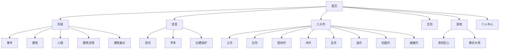
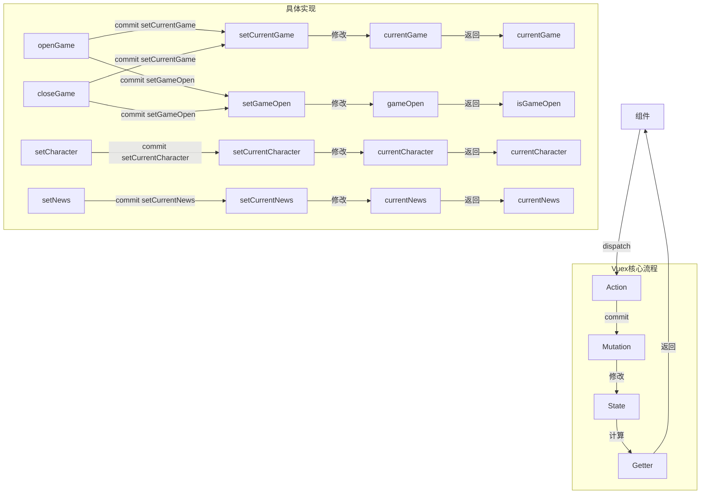
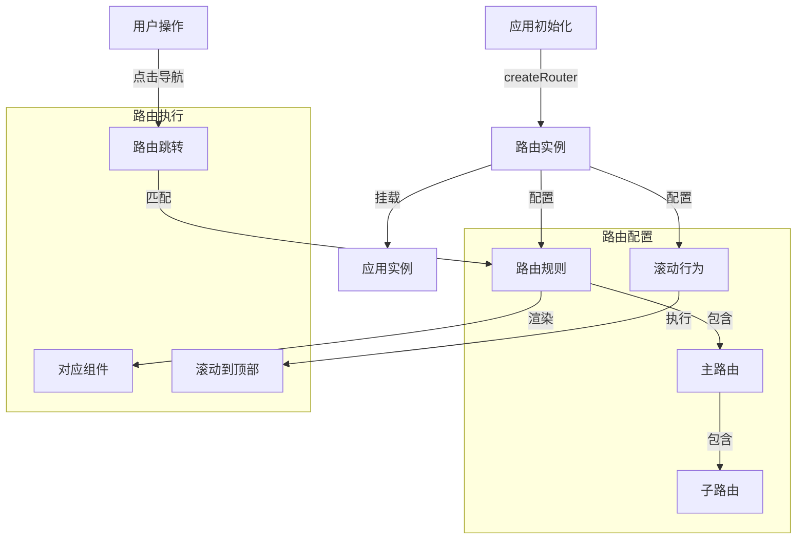
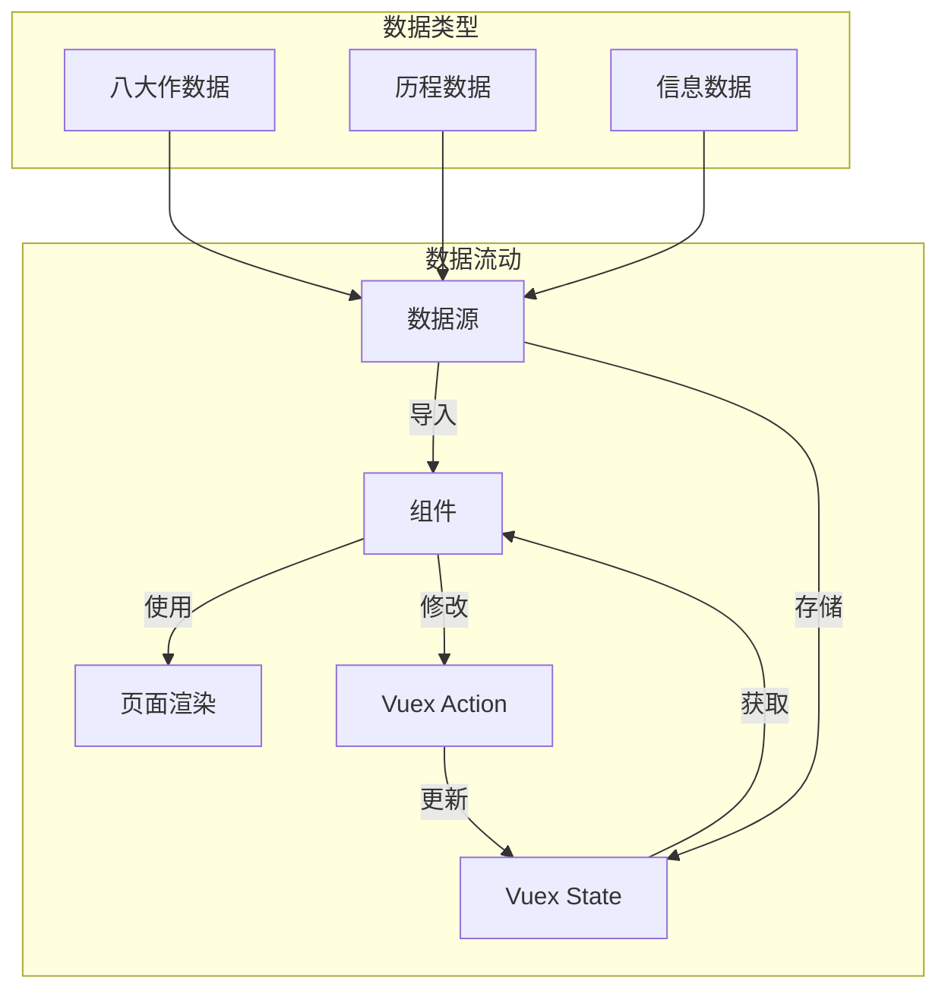

# 中国传统古建筑文化展示与互动平台设计文档

## 第一章 概要设计

### 1.1 功能模块分解

本项目是一个基于Vue 3的中国传统古建筑文化展示与互动平台，旨在通过现代化的Web技术，展现中国传统古建筑的魅力，促进文化传承。项目主要分为以下功能模块：

| 模块名称 | 主要功能 | 子模块 |
|---------|---------|--------|
| 首页 | 平台入口，展示核心内容 | 轮播图、项目介绍、历史、作品、文创、游戏区 |
| 历程 | 展示古建筑发展历史 | 事件、建筑、人物、建筑详情、建筑展示 |
| 信息 | 提供相关资讯和学术内容 | 资讯、学术、古建保护 |
| 八大作 | 介绍传统建筑工艺 | 土作、石作、搭材作、木作、瓦作、油作、彩画作、裱糊作 |
| 文创 | 展示文化创意产品 | 文创产品展示 |
| 游戏 | 提供互动体验 | 漆彩匠心、榫卯大师 |
| 个人中心 | 用户信息管理 | 用户资料、互动记录 |

### 1.2 模块层次结构与调用关系



### 1.3 模块间接口

| 模块 | 接口名称 | 功能描述 |
|------|---------|---------|
| 首页 | gameUrl | 游戏加载URL，用于打开游戏iframe |
| 首页 | showGame | 打开指定游戏 |
| 首页 | closeGame | 关闭游戏 |
| 历程 | architectureDetail | 建筑详情页跳转 |
| 信息 | newsDetail | 资讯详情页跳转 |
| 八大作 | selectNav | 切换八大作类型 |
| 八大作 | activeNavData | 获取当前选中的八大作数据 |
| 导航栏 | scrollToElement | 滚动到指定元素 |
| 导航栏 | toggleMusic | 切换音乐播放状态 |
| 导航栏 | navigateTo | 导航到指定路由 |

### 1.4 人机界面设计

- **整体风格**：采用中国传统风格与现代设计相结合，以深色背景配合传统元素，营造文化氛围
- **导航系统**：顶部固定导航栏，包含平台logo、主要功能模块链接，支持下拉菜单
- **交互方式**：流畅的滚动效果，悬停动画，模态框展示，游戏iframe嵌入
- **视觉层次**：通过背景图片、文字大小、颜色对比建立清晰的视觉层次
- **色彩方案**：以传统文化色彩为基础，搭配现代设计配色，体现传统与现代的融合
- **音频设计**：背景音乐播放功能，增强用户体验

## 第二章 详细设计

### 2.1 系统架构设计

#### 2.1.1 技术栈选择

- **前端框架**：Vue 3
- **状态管理**：Vuex
- **UI组件库**：Element Plus
- **路由管理**：Vue Router
- **构建工具**：Vite

#### 2.1.2 目录结构设计

```
src/
├── assets/            # 静态资源
│   ├── audio/         # 音频文件
│   ├── css/           # 样式文件
│   ├── font/          # 字体文件
│   └── img/           # 图片文件
├── components/        # 公共组件
│   ├── Footer.vue     # 页脚组件
│   ├── History.vue    # 历史组件
│   ├── Intro.vue      # 介绍组件
│   ├── Navbar.vue     # 导航栏组件
│   ├── Protect.vue    # 保护组件
│   ├── WenChuang.vue  # 文创组件
│   └── Works.vue      # 作品组件
├── hooks/             # 自定义hooks
├── router/            # 路由配置
│   └── index.js       # 路由定义
├── store/             # 状态管理
│   └── index.js       # 状态定义
├── views/             # 页面组件
│   ├── BaDaZuo/       # 八大作页面
│   ├── Game/          # 游戏页面
│   ├── History/       # 历程页面
│   ├── Info/          # 信息页面
│   ├── PersonalCenter/ # 个人中心页面
│   ├── WenChuang/     # 文创页面
│   └── Home.vue       # 首页
├── App.vue            # 应用根组件
├── main.js            # 应用入口
└── style.css          # 全局样式
```

### 2.2 核心功能设计

#### 2.2.1 首页设计

**设计思路**：
- 首页作为平台的入口，需要展示核心内容，吸引用户注意力
- 采用全屏轮播图展示中国著名古建筑，营造视觉冲击
- 分层设计，通过背景图片与前景内容形成深度感
- 板块式布局，清晰展示项目介绍、历史、作品、文创、游戏区等核心内容
- 游戏区卡片设计，点击可打开游戏iframe，提供沉浸式体验

**功能流程**：
1. 用户进入首页，浏览轮播图了解平台主题
2. 滚动页面，查看项目介绍、历史、作品等板块
3. 点击游戏卡片，进入互动游戏
4. 通过导航栏跳转到其他功能模块
5. 点击音乐图标，控制背景音乐播放

#### 2.2.2 八大作设计

**设计思路**：
- 八大作是中国传统建筑工艺的核心，需要详细展示每种工艺的特点和流程
- 顶部导航栏，包含八大作类型切换，支持悬停效果
- 视频播放器区域，展示对应工艺的视频介绍，支持控制功能
- 视频简介区域，提供工艺详细说明，布局清晰
- 技艺特性展示区域，图文并茂展示工艺特点，采用交错布局
- 毛玻璃效果，提升视觉层次感

**功能流程**：
1. 用户进入八大作页面，默认显示土作内容
2. 点击导航栏切换不同工艺类型
3. 观看工艺视频，了解基本流程
4. 滚动页面，查看详细的工艺特性介绍
5. 悬停在图片上，查看放大效果

#### 2.2.3 游戏集成设计

**设计思路**：
- 游戏是平台的互动核心，需要与主平台无缝集成
- 使用iframe嵌入外部游戏，保持游戏的独立性和完整性
- 通过Vuex管理游戏状态，实现游戏的打开和关闭
- 游戏容器采用固定定位，覆盖全屏，提供沉浸式体验
- 游戏关闭按钮采用动画效果，提升用户体验

**功能流程**：
1. 用户在首页或游戏页面点击游戏卡片
2. 游戏以iframe形式全屏打开
3. 用户进行游戏互动，了解传统工艺
4. 游戏结束后，点击关闭按钮返回平台

#### 2.2.4 导航系统设计

**设计思路**：
- 导航系统是用户浏览平台的核心，需要清晰、直观
- 动态生成导航项，支持一级和二级路由
- 下拉菜单功能，支持鼠标悬停显示
- 音乐控制功能，支持播放/暂停切换
- 平滑滚动到指定元素，提升用户体验

**功能流程**：
1. 用户进入平台，看到顶部导航栏
2. 鼠标悬停在导航项上，显示下拉菜单
3. 点击导航项，跳转到对应页面
4. 点击音乐图标，控制背景音乐播放
5. 点击首页的板块链接，平滑滚动到对应位置

### 2.3 状态管理设计

**设计思路**：
- 使用Vuex进行全局状态管理，集中管理应用状态
- 状态包括游戏状态、当前选中的人物和新闻等
- 通过mutations修改状态，通过actions处理异步操作
- 通过getters获取状态，方便组件使用
- 模块化管理状态，提高代码可维护性

**状态结构**：
- gameOpen：游戏是否打开
- currentGame：当前打开的游戏名称
- currentCharacter：当前选中的人物信息
- currentNews：当前选中的新闻信息

**状态管理流程**：
1. 组件通过dispatch调用action
2. action通过commit调用mutation
3. mutation修改state
4. 组件通过getter获取state的计算结果

**Vuex实现流程图**：



**Vuex使用场景**：

1. **游戏状态管理**：当用户点击游戏卡片时，通过`openGame` action打开游戏，设置`currentGame`和`gameOpen`状态
2. **人物详情管理**：当用户点击人物卡片时，通过`setCharacter` action设置`currentCharacter`状态
3. **新闻详情管理**：当用户点击新闻卡片时，通过`setNews` action设置`currentNews`状态

### 2.4 路由设计

**设计思路**：
- 使用Vue Router进行路由管理，支持嵌套路由
- 路由配置包括路径、名称、组件和元信息
- 支持滚动行为，每次路由跳转后滚动到页面顶部
- 动态生成导航项，减少代码冗余
- 使用哈希模式，确保在不同环境下的兼容性

**路由结构**：
- 首页：/ 
- 历程：/history，包含事件、建筑、人物等子路由
- 信息：/info，包含资讯、学术、古建保护等子路由
- 八大作：/badazuo
- 文创：/wencuang
- 游戏：/game
- 个人中心：/personalCenter

**Vue Router实现流程图**：



**路由执行流程**：
1. 应用初始化时，创建路由实例并配置路由规则
2. 用户点击导航项，触发路由跳转
3. 路由实例匹配对应的路由规则
4. 渲染对应的组件
5. 执行滚动行为，滚动到页面顶部

**动态导航实现**：
- 从路由配置中获取导航项，减少代码冗余
- 支持一级和二级路由的动态生成
- 导航项包含路径、名称和元信息

### 2.5 数据管理设计

**设计思路**：
- 本项目采用前端模拟数据，主要使用Vuex进行状态管理
- 数据包括八大作数据、历程数据、信息数据等
- 模块化管理数据，提高代码可维护性
- 数据与组件分离，便于统一管理和更新

**数据结构**：
1. **八大作数据**：包含每种工艺的标题、描述、视频URL、特性等详细信息
2. **历程数据**：包含历史事件、建筑、人物的详细信息
3. **信息数据**：包含资讯、学术、古建保护的相关内容

**数据管理流程图**：



**数据使用方式**：
1. **静态数据**：直接导入到组件中使用，如八大作的详细信息
2. **动态数据**：通过Vuex管理，如游戏状态、当前选中的人物和新闻
3. **计算数据**：通过计算属性处理后使用，如游戏URL的生成

### 2.6 界面设计原则

**设计思路**：
- 传统与现代结合：将中国传统建筑文化与现代Web技术相结合
- 视觉层次：通过背景图片、文字大小、颜色对比建立清晰的视觉层次
- 交互体验：流畅的滚动效果，悬停动画，提升用户体验
- 多媒体融合：整合图片、视频、文字等多种媒体形式
- 响应式设计：确保在不同设备上都能获得良好的用户体验

**设计元素**：
- 色彩：以传统文化色彩为基础，搭配现代设计配色
- 字体：使用传统风格的字体，提升文化氛围
- 图片：高质量的古建筑图片，展示传统建筑的魅力
- 动画：流畅的过渡动画，提升用户体验

### 2.7 技术实现思考

#### 2.7.1 游戏嵌入技术

**思考过程**：
- 游戏需要与主平台无缝集成，同时保持游戏的独立性
- 选择iframe嵌入方式，因为它可以完全隔离游戏和主平台的代码
- 通过Vuex管理游戏状态，实现游戏的打开和关闭
- 游戏容器采用固定定位，覆盖全屏，提供沉浸式体验
- 游戏关闭按钮采用CSS动画效果，提升用户体验

#### 2.7.2 轮播图实现

**思考过程**：
- 轮播图是首页的核心元素，需要展示中国著名古建筑
- 选择Element Plus的Carousel组件，因为它功能完善，易于使用
- 自定义轮播图样式，添加文字覆盖层，提升视觉效果
- 支持自动播放和手动切换，增强用户体验

#### 2.7.3 导航栏实现

**思考过程**：
- 导航栏是用户浏览平台的核心，需要清晰、直观
- 动态生成导航项，从路由配置中获取，减少代码冗余
- 下拉菜单功能，支持鼠标悬停显示，提升用户体验
- 音乐控制功能，支持播放/暂停切换，增强平台的互动性
- 平滑滚动到指定元素，提升用户体验

#### 2.7.4 八大作工艺展示

**思考过程**：
- 八大作是中国传统建筑工艺的核心，需要详细展示每种工艺的特点和流程
- 通过Vue 3的计算属性和响应式数据，实现八大作工艺的切换和展示
- 视频播放器控制，支持暂停和重置，提升用户体验
- 交错布局，文字与图片交替排列，增强视觉效果
- 毛玻璃效果，提升页面质感

### 2.8 重点与难点分析

**重点**：
- 传统文化元素的现代呈现：如何将传统建筑文化与现代Web技术相结合
- 游戏与主平台的无缝集成：如何实现游戏的嵌入和状态管理
- 八大作工艺的详细展示：如何清晰、生动地展示传统建筑工艺
- 多媒体内容的整合与优化：如何整合图片、视频、文字等多种媒体形式
- 用户体验的提升：如何通过交互设计提升用户体验

**难点**：
- 保持传统风格与现代用户体验的平衡：如何在保持传统风格的同时，提供现代的用户体验
- 游戏嵌入的性能优化：如何确保游戏嵌入不影响平台的性能
- 大量多媒体内容的加载与展示：如何优化多媒体内容的加载和展示
- 确保平台在不同设备上的稳定性：如何确保平台在不同设备上都能正常运行
- 复杂布局的实现与优化：如何实现复杂的布局并确保其性能

### 2.9 技术创新点

1. **传统与现代结合**：将中国传统建筑文化与现代Web技术相结合，创造出既有文化底蕴又现代感十足的用户体验

2. **互动式学习**：通过游戏化方式，让用户在互动中了解中国传统建筑工艺，提高学习兴趣

3. **沉浸式体验**：采用全屏设计、分层布局和动画效果，营造沉浸式的文化体验环境

4. **多媒体融合**：整合图片、视频、文字等多种媒体形式，提供丰富的内容展示方式

5. **工艺传承**：通过详细的八大作工艺介绍，促进传统建筑工艺的传承和传播

6. **毛玻璃效果**：使用backdrop-filter实现毛玻璃效果，提升页面视觉层次感

7. **动态导航**：从路由配置中动态生成导航项，减少代码冗余

## 总结

本项目通过现代化的Web技术，成功构建了一个展示中国传统古建筑文化的互动平台。平台不仅提供了丰富的文化内容，还通过游戏化的方式增强了用户互动体验，为传统文化的传承和传播提供了新的途径。

项目采用Vue 3 + Vuex + Element Plus技术栈，实现了游戏集成、轮播图、动画效果等功能，展现了现代Web技术在文化传播领域的应用潜力。

平台的核心价值在于：
1. **文化传承**：通过详细的八大作工艺介绍，促进传统建筑工艺的传承
2. **互动学习**：通过游戏化方式，让用户在互动中了解传统建筑文化
3. **多媒体展示**：整合图片、视频、文字等多种媒体形式，提供丰富的内容展示
4. **传统与现代结合**：将传统文化元素与现代Web技术相结合，创造出独特的用户体验
5. **用户体验**：通过精心的界面设计和交互效果，提供良好的用户体验

本项目为中国传统古建筑文化的传播和传承做出了积极贡献，具有较高的文化价值和社会意义。